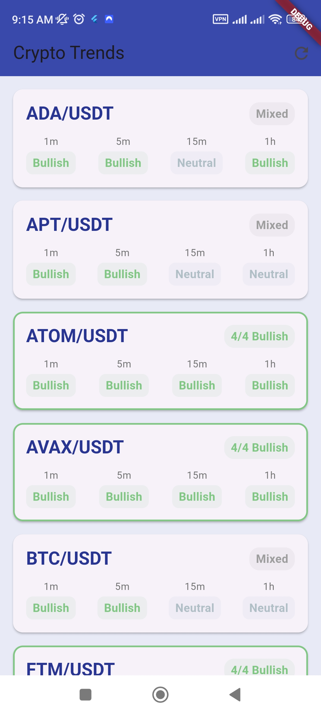
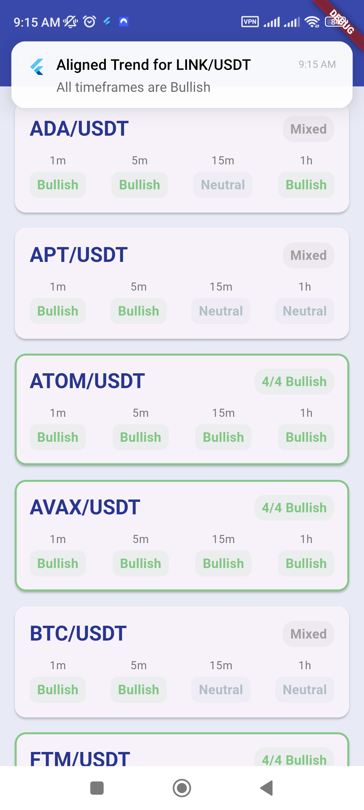

# TCLU Project

## Overview
**TCLU** (Tools for Cryptocurrency Lineup and Utility) is an integrated system that includes a Flutter-based frontend, a Flask-powered backend, and Python scripts to analyze cryptocurrency trading data. The project simplifies EMA calculations, alerts, and lineup management for crypto trading.

## Features
- **Frontend**: A Flutter application for displaying EMA lineups and sending email notifications.
- **Backend**: Flask server to process and serve trading data.
- **Trading Utilities**: Python scripts for:
  - Fetching MEXC Futures trading symbols.
  - Performing EMA-based lineup calculations.
  - Automating email notifications.
- **Dockerized Setup**: Ready for deployment with Docker.

## Prerequisites
- Python 3.8+
- Flutter SDK
- Docker (optional for containerized deployment)

## Installation
### Clone the Repository
```bash
git clone https://github.com/yourusername/TCLU.git
cd TCLU
```

### Backend Setup
1. Navigate to the Flask backend:
   ```bash
   cd flask_ema_backend
   ```
2. Install dependencies:
   ```bash
   pip install -r requirements.txt
   ```
3. Run the Flask server:
   ```bash
   python app.py
   ```

### Frontend Setup
1. Navigate to the Flutter frontend:
   ```bash
   cd flutter_ema_frontend
   ```
2. Install Flutter dependencies:
   ```bash
   flutter pub get
   ```
3. Launch the Flutter app:
   ```bash
   flutter run
   ```

### Using Docker (Optional)
1. Build the Docker image:
   ```bash
   docker build -t tclu-app .
   ```
2. Run the container:
   ```bash
   docker run -p 5000:5000 tclu-app
   ```

## Usage
### EMA Lineup Calculation
Run the Python script to calculate EMA lineups:
```bash
python emahelper.py
```

### Fetch Trading Symbols
Execute the script to retrieve MEXC Futures trading symbols:
```bash
python get_mexc_futures_symbols.py
```

### Email Notifications
Send email alerts for specific EMA lineups:
```bash
python emalineupwithemail.py
```

## Screenshots
### Frontend UI



## File Structure
```
TCLU/
├── flask_ema_backend/          # Flask backend for processing data
├── flutter_ema_frontend/       # Flutter frontend application
├── emahelper.py                # EMA lineup helper script
├── emalineupwithemail.py       # Email automation for EMA lineups
├── get_mexc_futures_symbols.py # Fetch MEXC Futures trading symbols
├── Dockerfile                  # Docker configuration
├── requirements.txt            # Python dependencies
└── Screenshots/                # UI images
```

## Contributing
Contributions are welcome! Please fork the repository and create a pull request with detailed notes.

## License
This project is licensed under the MIT License. See the `LICENSE` file for details.

## Contact
For questions or feedback, reach out at [bernardkibathi@gmail.com].

---

Let me know if you want this customized further or formatted for your specific needs.
